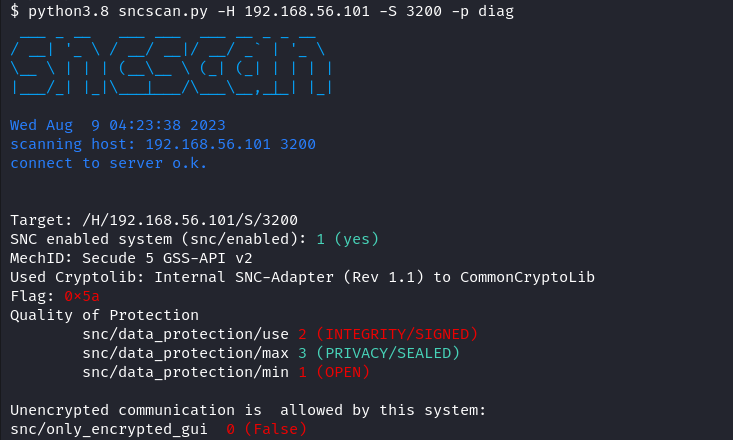

# sncscan
Tool for analyzing SAP SNC Communication Security.



# How to use?

In its current state, `sncscan` can be used to read the SNC configurations for SAP Router and DIAG (SAP GUI) connections. The implementation for the SAP RFC protocol is currently in development.


## SAP Router

SAP Routers can either support SNC or not, a more granular configuration of the SNC parameters is not possible.
Nevertheless, it is possible to find out if it is activated:

```
sncscan -H 10.3.161.4 -S 3299-p router
```


## DIAG / SAP GUI

The SNC configuration of a DIAG connection used by a SAP GUI can have more versatile settings than the router configuration.
A detailled overview of the system parameterss that can be read with `sncscan` and impact the connections security is in the section [Background](#Background: SNC system parameters)

```
sncscan -H 10.3.161.3 -S 3200 -p diag
```

### Through SAP Router

```
sncscan --route-string /H/10.3.161.5/S/3299/H/10.3.161.3/S/3200 -p diag
```
###

# Install
Requirements: Currently the sncscan only works with python3.8 and the pysap libary from our fork. 

```$ python3.8 -m pip install -r requirements.txt```

or

```$ python3.8 setup.py test```

```$ python3.8 setup.py install```


# Background: SNC system parameters

## SNC Basics
SAP protocols by default do not provide high security, to increase security and ensure Authentication, Integrity and Encryption SNC (Secure Network Connections) is used.
SNC protects the data communication paths between various client and server components of the SAP system that use the RFC, DIAG or router protocol by applying known cryptographic algorithms to the data in order to increase its security. These protocols are unencrypted by default.
There are three different levels of security that can be applied:

1. Authentication only: Verifies the identity of the communication partners
2. Integrity protection: Protection against manipulation of the data
3. Confidentiality protection: Encrypts the transmitted messages
## SNC Parameter
Each SAP system can be configured with SNC parameters for the communication security. 
The level of the SNC connection is determined by the Quality of Protection parameters:
- snc/data_protection/min: Minimum security level required for SNC connections.
- snc/data_protection/max: highest security level, initiated by the SAP system
- snc/data_protection/use: default security level, initiated from the SAP system

Additional SNC parameters can be used for further system-specific configuration options, including the snc/only_encrypted_gui parameter, which ensures that encrypted SAPGUI connections are enforced. 


## Reading out SNC Parameters

As long as a SAP System is addressed that is capable of sending SNC messages, it also responds to valid SNC requests, regardless of which IP, port, and CN were specified for SNC. 
This response contains the requirements that the SAP system has for the SNC connection, which can then be used to obtain the SNC parameters.
This can be used to find out whether an SAP system has SNC enabled and, if so, which SNC parameters have been set.


